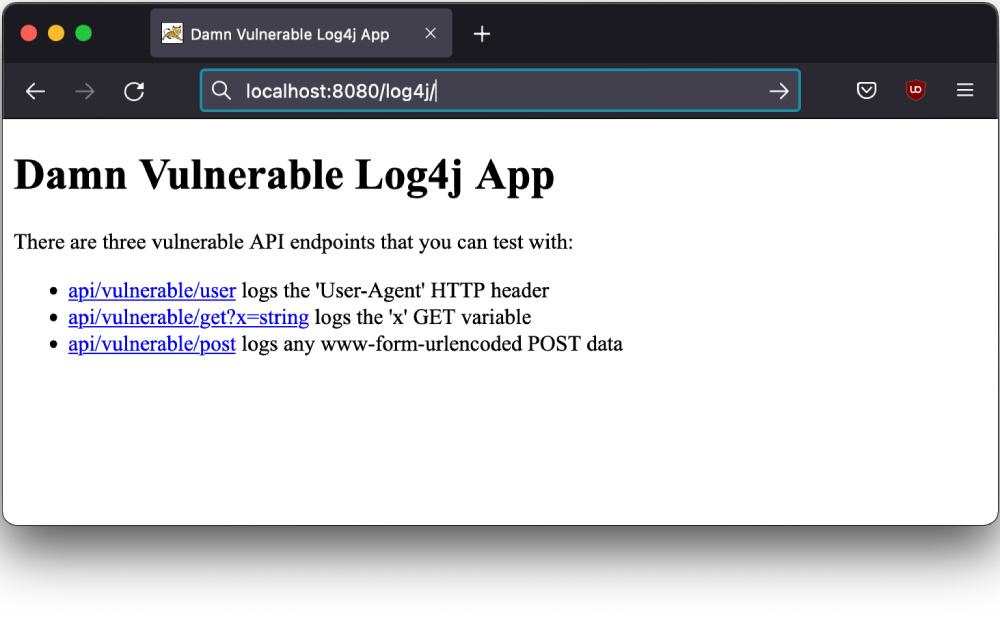
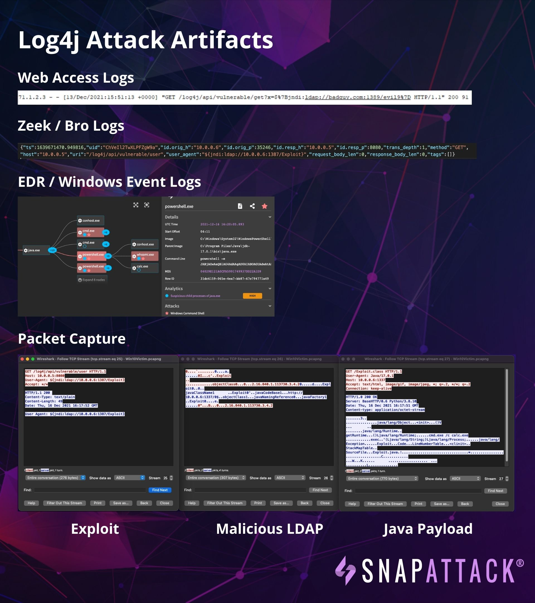

# SnapAttack Log4j / CVE-2021-44228 / log4shell Resources

## What's included?

### Damn Vulnerable Log4j App

[damn-vulnerable-log4j-app](damn-vulnerable-log4j-app) contains a basic vulnerable Java Servlet that logs the User Agent, HTTP GET and POST parameters with log4j.  It is packaged as a .war file and can be deployed to servers like Tomcat.  See the [README](damn-vulnerable-log4j-app/README.md) for more information.

### Attack Artifacts

[attack-artifacts](attack-artifacts) contains example EDR, system, and application logs, as well as a PCAP and Zeek logs from an attack against a Windows victim machine. You can see the attack in our video at https://www.youtube.com/watch?v=X7cLgDoX6KU.  In the future, content like this will be freely available in the community edition of SnapAttack.  If you're interested, you can [request an invite](https://www.snapattack.com/request/invite).

## License
All resources in this repository are provided under the [MIT License](LICENSE).